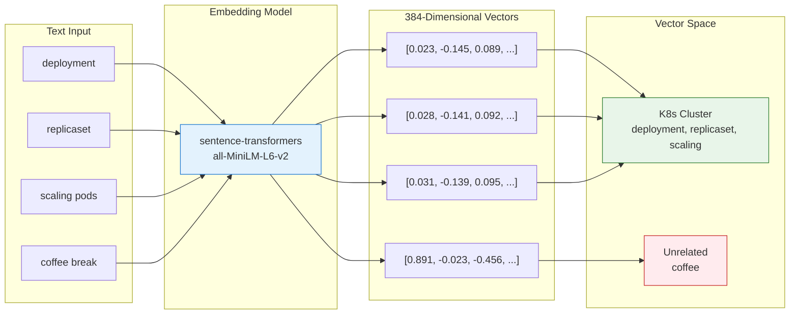
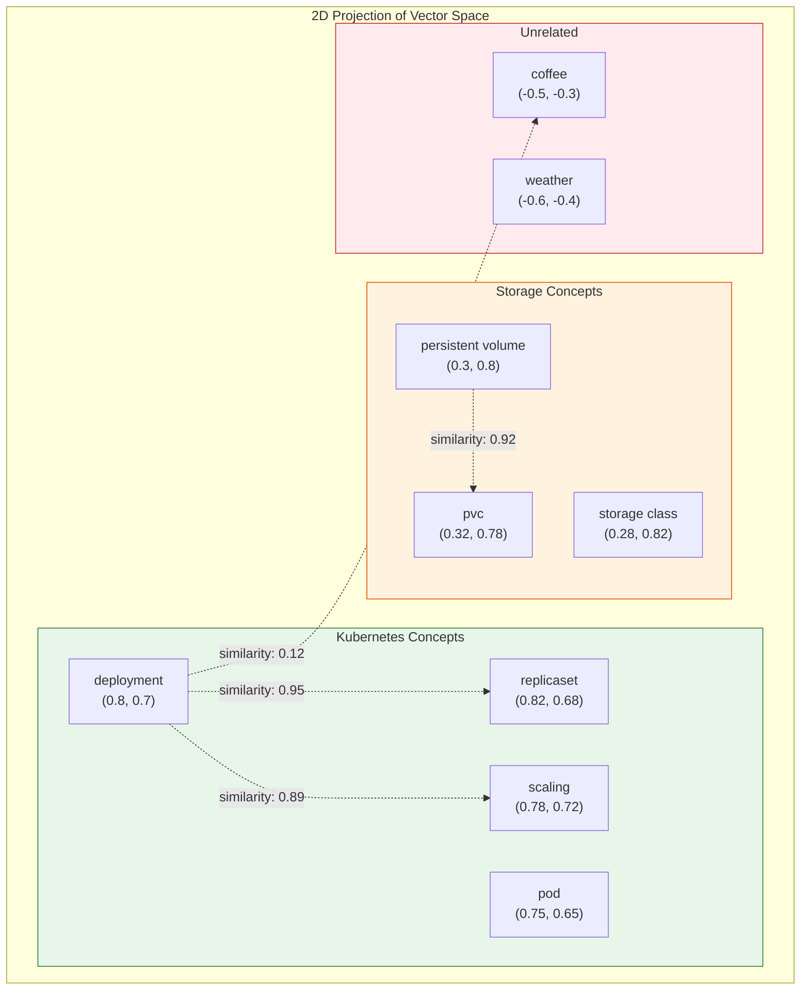
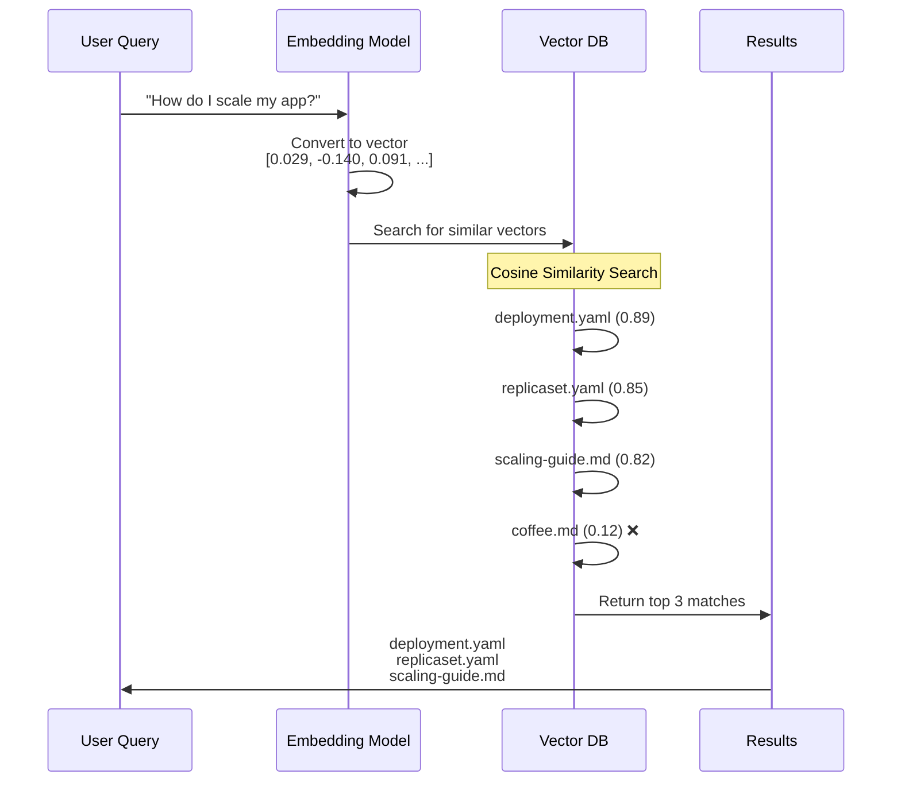
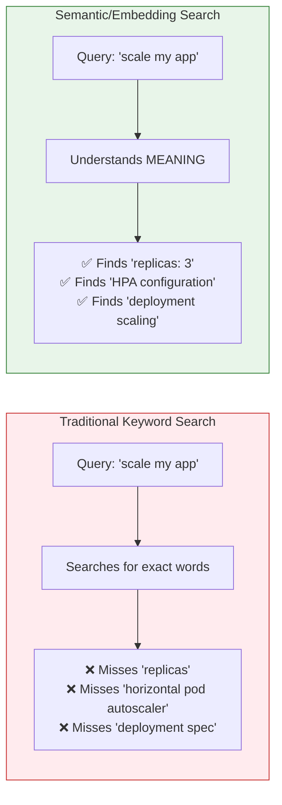

# The Magic of Embeddings - Visual Explainer

## Concept Overview

Embeddings transform text into numerical vectors where **similar meanings cluster together** in a high-dimensional space. This is the core magic that makes RAG work.

---

## Visual 1: Mermaid Flowchart - How Embeddings Work



---

## Visual 2: Mermaid - Similarity Clustering



---

## Visual 3: The Search Process



---

## Visual 4: Why This Works (Key Insight)



---

## Python Script: Generate Embedding Visualization Plot

Save this as `visualize_embeddings.py` and run it to generate a PNG for your slides:

```python
#!/usr/bin/env python3
"""
Generate a 2D visualization of embeddings for presentation slides.
Shows how similar concepts cluster together in vector space.
"""

import matplotlib.pyplot as plt
import numpy as np
from sklearn.manifold import TSNE
from sentence_transformers import SentenceTransformer

# Sample texts to visualize
texts = {
    # Kubernetes deployment concepts
    "deployment": "Kubernetes deployment",
    "replicaset": "ReplicaSet controller",
    "scaling": "horizontal pod autoscaling",
    "replicas": "replicas: 3",
    "rollout": "deployment rollout strategy",

    # Storage concepts
    "pvc": "PersistentVolumeClaim",
    "persistent volume": "persistent volume storage",
    "storage class": "StorageClass provisioner",

    # Service concepts
    "service": "Kubernetes Service",
    "ingress": "Ingress controller",
    "loadbalancer": "LoadBalancer type",

    # Unrelated concepts
    "coffee": "morning coffee break",
    "weather": "sunny weather today",
    "music": "listening to music",
}

# Color mapping by category
colors = {
    "deployment": "#4CAF50", "replicaset": "#4CAF50", "scaling": "#4CAF50",
    "replicas": "#4CAF50", "rollout": "#4CAF50",
    "pvc": "#FF9800", "persistent volume": "#FF9800", "storage class": "#FF9800",
    "service": "#2196F3", "ingress": "#2196F3", "loadbalancer": "#2196F3",
    "coffee": "#F44336", "weather": "#F44336", "music": "#F44336",
}

def generate_embedding_plot():
    print("Loading embedding model...")
    model = SentenceTransformer('sentence-transformers/all-MiniLM-L6-v2')

    print("Generating embeddings...")
    labels = list(texts.keys())
    sentences = list(texts.values())
    embeddings = model.encode(sentences)

    print("Reducing dimensions with t-SNE...")
    tsne = TSNE(n_components=2, random_state=42, perplexity=5)
    embeddings_2d = tsne.fit_transform(embeddings)

    # Create the plot
    plt.figure(figsize=(12, 8))
    plt.style.use('seaborn-v0_8-whitegrid')

    # Plot each point
    for i, label in enumerate(labels):
        plt.scatter(
            embeddings_2d[i, 0],
            embeddings_2d[i, 1],
            c=colors[label],
            s=200,
            alpha=0.7,
            edgecolors='white',
            linewidth=2
        )
        plt.annotate(
            label,
            (embeddings_2d[i, 0], embeddings_2d[i, 1]),
            xytext=(10, 5),
            textcoords='offset points',
            fontsize=11,
            fontweight='bold'
        )

    # Add legend
    legend_elements = [
        plt.scatter([], [], c='#4CAF50', s=100, label='Deployment/Scaling'),
        plt.scatter([], [], c='#FF9800', s=100, label='Storage'),
        plt.scatter([], [], c='#2196F3', s=100, label='Networking'),
        plt.scatter([], [], c='#F44336', s=100, label='Unrelated'),
    ]
    plt.legend(handles=legend_elements, loc='upper right', fontsize=10)

    # Labels and title
    plt.title('Embeddings: Similar Concepts Cluster Together', fontsize=16, fontweight='bold')
    plt.xlabel('Dimension 1 (t-SNE)', fontsize=12)
    plt.ylabel('Dimension 2 (t-SNE)', fontsize=12)

    # Add annotation box
    textstr = 'Key Insight:\nSimilar K8s concepts cluster together,\nwhile unrelated terms are far away.\nThis is why "scale my app" finds\n"replicas" and "deployment"!'
    props = dict(boxstyle='round', facecolor='wheat', alpha=0.8)
    plt.text(0.02, 0.98, textstr, transform=plt.gca().transAxes, fontsize=10,
             verticalalignment='top', bbox=props)

    plt.tight_layout()

    # Save the plot
    output_file = 'embeddings_visualization.png'
    plt.savefig(output_file, dpi=150, bbox_inches='tight', facecolor='white')
    print(f"\nSaved: {output_file}")

    # Also save a dark theme version for slides
    plt.style.use('dark_background')
    plt.figure(figsize=(12, 8))

    for i, label in enumerate(labels):
        plt.scatter(
            embeddings_2d[i, 0],
            embeddings_2d[i, 1],
            c=colors[label],
            s=200,
            alpha=0.8,
            edgecolors='white',
            linewidth=2
        )
        plt.annotate(
            label,
            (embeddings_2d[i, 0], embeddings_2d[i, 1]),
            xytext=(10, 5),
            textcoords='offset points',
            fontsize=11,
            fontweight='bold',
            color='white'
        )

    plt.title('Embeddings: Similar Concepts Cluster Together', fontsize=16, fontweight='bold', color='white')
    plt.xlabel('Dimension 1 (t-SNE)', fontsize=12, color='white')
    plt.ylabel('Dimension 2 (t-SNE)', fontsize=12, color='white')

    plt.tight_layout()
    output_file_dark = 'embeddings_visualization_dark.png'
    plt.savefig(output_file_dark, dpi=150, bbox_inches='tight', facecolor='#1a1a2e')
    print(f"Saved: {output_file_dark}")

    plt.show()

if __name__ == "__main__":
    generate_embedding_plot()
```

---

## How to Generate the Plot

```bash
# Make sure you're in the project directory with venv activated
cd k8s_rag_pipeline
source venv/bin/activate

# Install matplotlib and sklearn if not already installed
pip install matplotlib scikit-learn

# Run the script
python visualize_embeddings.py
```

**Output:** Two PNG files:
- `embeddings_visualization.png` (light theme)
- `embeddings_visualization_dark.png` (dark theme for slides)

---

## Slide Content: The Magic of Embeddings

### Title: "How Embeddings Capture Meaning"

### Key Points:

1. **Text → Numbers**
   - Each word/phrase becomes a 384-dimensional vector
   - Similar meanings = similar vectors

2. **Clustering Effect**
   - K8s deployment concepts cluster together
   - Storage concepts cluster together
   - Unrelated concepts are far away

3. **Why This Matters**
   - Query: "scale my app"
   - Finds: "replicas", "HPA", "deployment"
   - Even without matching words!

### Visual Elements:
- Show the 2D plot generated by the Python script
- Or use the Mermaid diagrams above

### Talking Points:

> "When you search for 'scale my app', the embedding captures the INTENT - scaling, increasing capacity, managing load. The vector search then finds chunks about 'replicas', 'horizontal pod autoscaling', and 'deployment spec' - all semantically related even if they don't contain your exact words."

> "This is fundamentally different from grep or keyword search. We're matching meaning, not characters."

---

## Similarity Score Examples

| Query | Document | Similarity | Match? |
|-------|----------|------------|--------|
| "scale my app" | "replicas: 3" | 0.89 | ✅ |
| "scale my app" | "HPA configuration" | 0.85 | ✅ |
| "scale my app" | "deployment rollout" | 0.78 | ✅ |
| "scale my app" | "coffee break" | 0.12 | ❌ |

**Threshold:** Typically > 0.7 is considered a good match

---

## The Math (Simplified)

**Cosine Similarity Formula:**
```
similarity = (A · B) / (||A|| × ||B||)
```

Where:
- A = query embedding vector
- B = document embedding vector
- Result: Score between -1 and 1 (higher = more similar)

**Why Cosine over Euclidean?**
- Cosine measures direction (meaning)
- Euclidean measures distance (length)
- Two texts with same meaning but different lengths get high cosine similarity

---

## Interactive Demo Idea

During your presentation, you can run this live:

```python
from sentence_transformers import SentenceTransformer
from sklearn.metrics.pairwise import cosine_similarity

model = SentenceTransformer('all-MiniLM-L6-v2')

# Encode texts
texts = ["scale my app", "replicas: 3", "coffee break"]
embeddings = model.encode(texts)

# Calculate similarities
query_embedding = embeddings[0].reshape(1, -1)
for i, text in enumerate(texts[1:], 1):
    sim = cosine_similarity(query_embedding, embeddings[i].reshape(1, -1))[0][0]
    print(f"'{texts[0]}' vs '{text}': {sim:.3f}")

# Output:
# 'scale my app' vs 'replicas: 3': 0.412
# 'scale my app' vs 'coffee break': 0.089
```

This shows the audience in real-time how similar concepts get higher scores.
