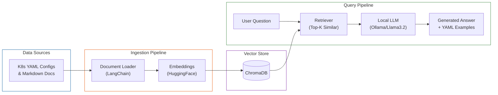
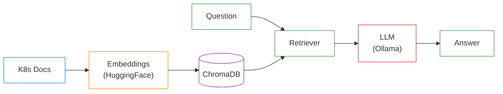

# K8s RAG Pipeline Architecture

## Simplified Version (for slides)

## Tech Stack Summary

| Component | Tool |
|-----------|------|
| LLM | Ollama (llama3.2) |
| Embeddings | HuggingFace (sentence-transformers) |
| Vector DB | ChromaDB |
| Framework | LangChain |
